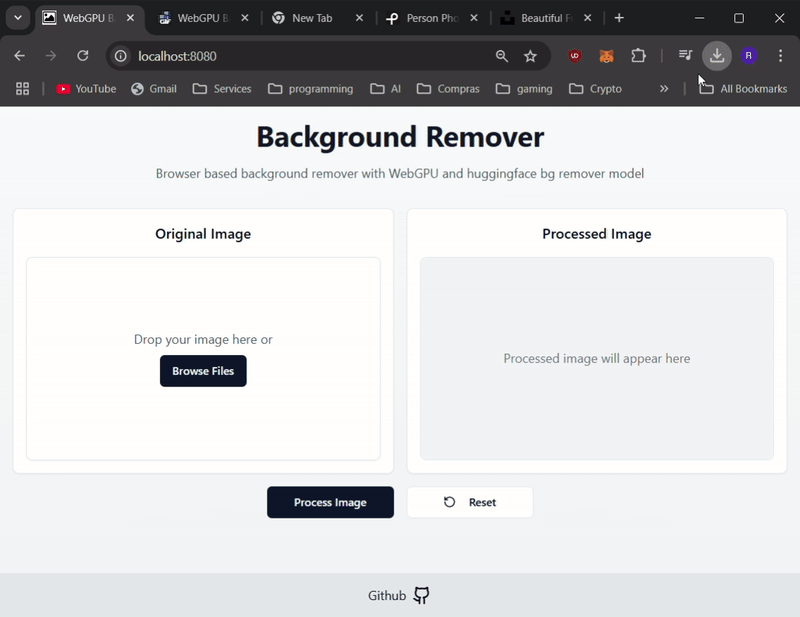

# WebGPU Playground

## Overview

This project is designed to test the WebGPU API by implementing a background removal tool. It uses a hugging face model to perform real-time image processing, ensuring fast and smooth performance directly in the browser.

For more info on WebGPU API: <a target='_blanck' href='https://developer.mozilla.org/en-US/docs/Web/API/WebGPU_API'> Click here</a>



## What technologies are used for this project?

This project is built with

- Vite
- TypeScript
- React
- radix-ui
- Tailwind CSS
- WebGPU

**Instructions**

To initialize the project follow these steps:

```sh
# Step 1: Clone the repository using the project's Git URL.
git clone <git_url>

# Step 2: Navigate to the project directory.
cd <project_name>

# Step 3: Install the necessary dependencies.
pnpm i

# Step 4: Start the development server with auto-reloading and an instant preview.
pnpm run dev
```

## Observations

WebGPU is relatively new and not supported by all browsers, compatibility with hugging face models is limited with the transformers.js library, new functionalities like inpainting and object removal will be added when supported
